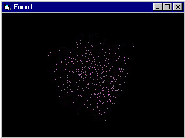



## Simple 3D Tute w/ mouse control

### Description

3d points shuffled within cubic space rotate according to mouse movement - click and drag over the draw space
 
### More Info
 

             |
---                |---
**Submitted On**   |2001-09-27 03:26:56
**By**             |[easfw](https://github.com/Planet-Source-Code/PSCIndex/blob/master/ByAuthor/easfw.md)
**Level**          |Beginner
**User Rating**    |5.0 (10 globes from 2 users)
**Compatibility**  |VB 6\.0
**Category**       |[Graphics](https://github.com/Planet-Source-Code/PSCIndex/blob/master/ByCategory/graphics__1-46.md)
**World**          |[Visual Basic](https://github.com/Planet-Source-Code/PSCIndex/blob/master/ByWorld/visual-basic.md)
**Archive File**   |[Simple 3D 270419272001\.zip](https://github.com/Planet-Source-Code/easfw-simple-3d-tute-w-mouse-control__1-26390/archive/master.zip)

### API Declarations

SetPixelV

